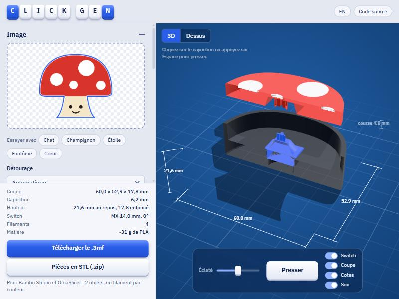

# ClickGen

**Turn any image into a 3D-printable mechanical-switch clicker.** Drop a logo, a mascot or a drawing: ClickGen cuts out the shape, fits a keyboard switch (Cherry MX compatible) inside, colors the cap with the image's colors and exports a **multicolor .3mf for Bambu Studio / OrcaSlicer** (or STL files).



Everything runs in your browser: your images never leave your computer and no network request is made once the page has loaded.

[Version française](README.md)

## Use it

- **Locally**: `npm run serve` (Node 18+), then <http://localhost:5173>. An HTTP server is required: the 3D computation runs in a Web Worker with WebAssembly, which does not work from `file://`.
- **Online**: the folder is a static site, publish it as is (GitHub Pages, Netlify…). There is nothing to build. All paths are relative: the site also works under a prefix (`/clickgen/`). Behind a reverse proxy, `NODE_ENV=production HOST=0.0.0.0 PORT=8034 node tools/serve.mjs` serves the site with ETag, gzip and caching (hidden files and write methods are refused).

## What you need

- An **MX-compatible mechanical switch** (Cherry, Gateron, Kailh, Outemu…). A *clicky* (blue) switch gives the real click.
- An FDM printer, 0.4 mm nozzle, PLA. No supports needed.
- For the multicolor decor: one filament per distinct color (AMS, AMS lite or manual swaps).

## What it does

- **Image to clicker**: the image outline becomes the shell shape, its colors become the cap's decor.
- **Frames**: circle, rounded square, hexagon, octagon, shield, pill… The image (a photo, a complicated logo) becomes the decor of a clean shape, fitted so nothing overflows.
- **Text and emojis**: type a name (up to three lines, six fonts), pick a frame and colors.
- **Several switches**: 2 or 3 switches in the same clicker (the “Switches in the clicker” setting): the cap, held at several points, rocks less when you press on one side. The group places itself (same angle, at least 16 mm apart) and moves as one block in the top view.
- **Key ring**: a flat drilled lug at the position you want on the outline.
- **Test coupon**: a small plate printed in 25 minutes (4 pockets, 4 crosses) to dial in the fit *before* a big clicker.
- **Live preview**: press the cap (click, Space or button) with the sound of a clicky, tactile or linear switch; exploded view, cutaway, visible switch, dimensions, top view, **plate view** (the flipped cap as it prints, no supports). The **Regenerate** button redoes the whole computation without reusing anything cached.
- **Projects**: save and reopen a project (`.clickgen.json`) with the image, colors and all settings.
- **Export**: multicolor `.3mf` (Bambu Studio / OrcaSlicer, selectable layer height) or a zip of STL files. By default the `.3mf` holds **two plates** (the shell, then the cap): far fewer filament changes (see below).

## How it works

1. **Cut-out**: image transparency, or background color (sampled on the borders, or picked with the eyedropper; adjustable tolerance). The outline is traced at sub-pixel precision, smoothed, then cleaned in millimeters (narrow gaps closed, details thinner than the nozzle removed).
2. **Two parts**: the **shell** follows the silhouette (or the frame); the **cap** is that shape shrunk by the wall (2 mm) and the clearance (0.6 mm). It slides inside the shell.
3. **Switch placement**: ClickGen searches the cap for the position and angle where the switch square (14.8 mm relief + walls) fits entirely, as close as possible to the center of mass. With 2 or 3 switches it looks for an arrangement (same angle, at least 16 mm between squares) that spreads them apart and balances them around the center of mass. Shapes that are too small are enlarged to the minimum needed (can be disabled).
4. **Colors**: the image is reduced to 1–5 colors (k-means in Lab, final color = median of the pixels). With a cut-out subject, the background is the cap color and each subject color becomes a decor layer, printed against the bed.
5. **Export**: a `.3mf` with the shell upright (plate 1) and the **flipped cap**, decor-side down (plate 2), one filament per distinct color and a purge tower where colors change; or a zip of STL files. A single plate is still available.

## Print and assemble

1. Open the `.3mf` in Bambu Studio or OrcaSlicer, check the filaments, print plate 1 (shell) then plate 2 (cap).
2. Press each switch into its pocket in the shell from above (pins into the cavity): it is held by friction.
3. Push the cap onto the switches' cross stems. It must be able to travel 4 mm; the shell wraps it almost down to the bottom. With several switches, hold the cap flat before pushing: all the stems must enter together.

### Time and PLA: one plate or two?

On a single plate Bambu Studio prints layer by layer and swaps filament on every layer where shell and cap exist together. Slicer measurements (Bambu Studio CLI, A1 mini, 0.16 mm, 60 mm disc):

| Filaments | One plate | Two plates | Filament changes |
| --- | --- | --- | --- |
| 2 (shell + plain cap) | 2 h 32, 40 g | 1 h 17, 25 g | 42 → 0 |
| 4 (3-color cap) | 2 h 55, 45 g | 1 h 40, 29 g | 52 → 10 |
| 6 (5-color cap) | not measured | 2 h 01, 33 g | 20 on the cap plate |

These are slicer estimates, not stopwatch times. With a single filament the layout makes no difference. With two plates, a plain-cap clicker needs no AMS at all: one spool for the shell, another for the cap.

The 3MF carries the settings of a **Bambu Lab A1 mini** (0.4 mm nozzle, 0.16 mm layers, 2 walls, 15 % infill). On another machine, simply change printer in the slicer: parts and filaments are kept.

## Tuning the fit

Default dimensions (14.0 mm pocket, 4.13 × 1.12 mm cross, 0.6 mm cap/shell clearance) come from the Cherry MX datasheet and from clickers printed by other makers. **They have not been validated by the author on every printer**: each machine prints holes slightly smaller or larger. In the "Fit" section:

- *Switch pocket*: + widens the 14 mm square, − tightens it.
- *Cross socket grip*: + widens the cap's cross, − tightens it.
- *Cap / shell clearance*: increase it if the cap rubs.
- *Stem sleeve diameter*: reduce it if your switch has a "box" around the stem.

Adjust in steps of 0.05 to 0.1 mm after a first test print.

## Development

```bash
npm test          # 70 tests: image, placement (1 to 3 switches), mechanical dimensions, interference over the full travel, frames, 3MF, STL, worker guard rails
npm run serve     # dev server on port 5173
```

- `src/image/` cut-out, contours, colors · `src/geometry/` placement and solids ([manifold-3d](https://github.com/elalish/manifold)) · `src/export/` 3MF, STL, plate layout · `src/view/` 3D and 2D previews · `src/worker.js` off-main-thread computation.
- Design notes (dimensions, vertical stack, print orientation, Bambu 3MF format): [`docs/DESIGN.md`](docs/DESIGN.md) (French).
- Generated 3MF files are sliced with Bambu Studio's CLI (`return_code 0`, filaments, colors and plates preserved, up to 7 filaments). The purge tower footprint was measured in the produced G-code (2 to 7 filaments).

## Known limits

- The outline of a very detailed image or photo is complicated: pick a **frame** instead (the image stays as the decor), or use a logo, a mascot or flat art on a transparent or plain background.
- Beyond 4 filaments loaded at once an AMS lite is not enough: reduce the color count or give two parts the same color. On two plates only the cap counts (4 colors at most, the shell is loaded separately); on one plate the shell counts too.
- Only one piece is kept (the largest); detached islands are ignored.
- **Several switches**: their springs add up (it takes two or three times the force). One *clicky* switch is enough for the click, the others can be linear. Only the first switch's cross grips its stem; the others have 0.1 mm of extra play so the cap is not over-constrained (a design assumption, not yet tried on a printed part). Shapes that are too thin or too hollow cannot hold three, even enlarged: ClickGen says so.
- Only the A1 mini profile is embedded in the 3MF. The "256 mm" choice changes the layout and the maximum size, not the embedded profile (180 mm plate in the config): pick your printer in the slicer afterwards (not verified with a real P1S/X1 profile).
- Decor **relief** (the "Relief" slider) leaves the flipped cap face floating: the 3MF then turns supports on for the cap, and the face is slightly rough.
- The cap travels the full 4 mm in the interference simulation (simplified switch model); the author has not yet printed and tried a prototype with a real switch.

## License

MIT, see [`LICENSE`](LICENSE). Third-party components (manifold-3d, three.js, fflate, IBM Plex): [`THIRD_PARTY.md`](THIRD_PARTY.md). ClickGen is not affiliated with Cherry, Bambu Lab or ClickerFactory.
